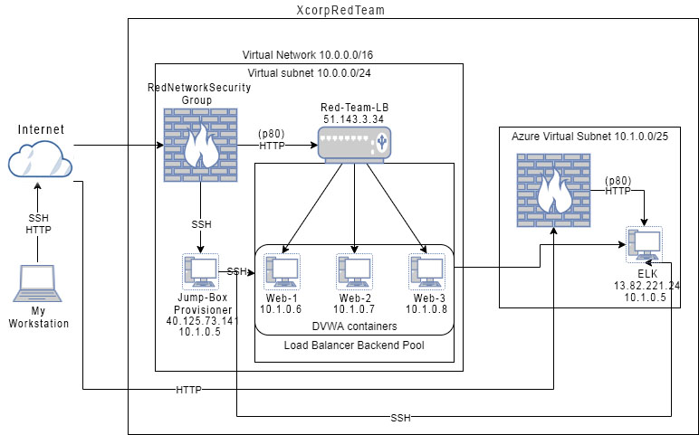

## Automated ELK Stack Deployment

The files in this repository were used to configure the network below.

**Note**: The following image link needs to be updated. Replace `diagram_filename.png` with the name of your diagram image file.  

These files have been tested and used to generate a live ELK deployment on Azure. They can be used to either recreate the entire deployment pictured above. Alternatively, select portions of the `install_elk.yml` file may be used to install only certain pieces of it, such as Filebeat.

This document contains the following details:
- Description of the Topology
- Access Policies
- ELK Configuration
  - Beats in Use
  - Machines Being Monitored
- How to Use the Ansible Build

### Description of the Topology

The main purpose of this network is to expose a load-balanced and monitored instance of DVWA, the D*mn Vulnerable Web Application.

Load balancing ensures that the application will be highly redundant, in addition to restricting access to the network.
- Load balancers make sure that servers and networks are availiable. 
- A JumpBox creates a single point of entry.

Integrating an ELK server allows users to easily monitor the vulnerable VMs for changes to the files and system logs.
- Filebeat monitors files and specific system logs.
- Metricbeat monitors resource usage and prints out to readable format.

The configuration details of each machine may be found below.

| Name     | Function | IP Address | Operating System |
|----------|----------|------------|------------------|
| Jump Box | Gateway  | 10.0.0.5   | Linux            |
| web-1     | Webserver         | 10.1.0.6           | Linux                 |
| web-2     | Webserver         | 10.1.0.7           | Linux                 |
| web-3     | Webserver         | 10.1.0.8           | Linux                 |

### Access Policies

The machines on the internal network are not exposed to the public Internet. 

Only the JumpBox machine can accept connections from the Internet. Access to this machine is only allowed from the following IP address:
- 174.85.71.71

Machines within the network can only be accessed by JumpBox.
- The ELK-VM can only be accessed from the JumpBox through the ansible container using the IP 10.1.0.5

A summary of the access policies in place can be found in the table below.

| Name     | Publicly Accessible | Allowed IP Address |
|----------|---------------------|----------------------|
| Jump Box | Yes/No              | 174.85.71.71    |
| web-1         | no                    | 174.85.71.71                     |
| web-2         | no                    | 174.85.71.71                     |
| web-3         | no                    | 174.85.71.71                     |

### Elk Configuration

Ansible was used to automate configuration of the ELK machine. No configuration was performed manually, which is advantageous because...
- Ansible allows for quick and consistent deployment without having to configure each of your machines manually. You can create playbooks that can be launched whenever needed. 

The playbook implements the following tasks:
- Docker.io
- Installs pip3
- Install Docker Python Modules
- Increase Virtual Memory
- Uses mem
- Downloads and Launches docker ELK containers 

The following screenshot displays the result of running `docker ps` after successfully configuring the ELK instance.

### Target Machines & Beats
This ELK server is configured to monitor the following machines:
- web-1 10.1.0.6
- web-2 10.1.0.7
- web-3 10.1.0.8

We have installed the following Beats on these machines:
- Filebeat
- Metricbeat

These Beats allow us to collect the following information from each machine:
- Filebeat collects eventlogs on the webservers and sends it over to kibana to analyze and authenticate their integrity.
- Metricbeat monitors resource usage on machines such as uptime, and sends it do kibana to be analyzed.

### Using the Playbook
In order to use the playbook, you will need to have an Ansible control node already configured. Assuming you have such a control node provisioned: 

SSH into the control node and follow the steps below:
- Copy the `install_elk.yml` file to `/etc/ansible/files`.
- Update the hosts file to include the private IP addresses of the machines you intend to run the playbook(s) on.
- Run the playbook, and navigate to kibana to check that the installation worked as expected.

Thank you :) 
